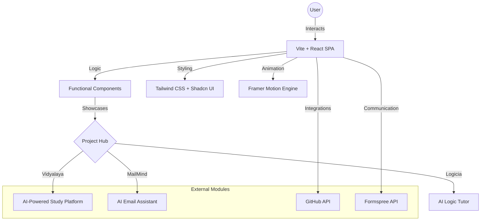
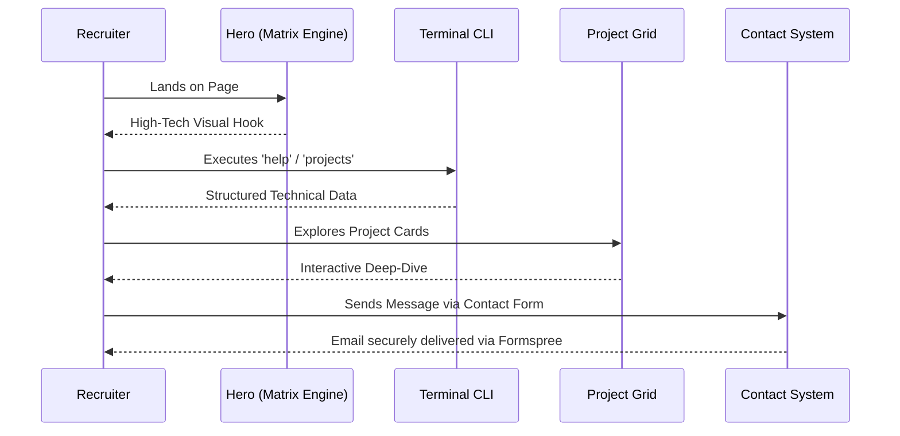

# 🚀 Durga Vara Prasad's Professional Engineering Portfolio

**A High-Performance, Neo-Brutalist Digital Identity & Engineering Showcase**

[](https://vitejs.dev/)
[](https://reactjs.org/)
[](https://www.typescriptlang.org/)
[](https://tailwindcss.com/)
[](https://www.framer.com/motion/)
[](https://ui.shadcn.com/)

[**Live Demo**](https://vara-s-portfolio.vercel.app/) • [**Source Code**](https://github.com/VARA4u-tech/Vara-s--Portfolio) • [**Request Collaboration**](mailto:pappuridurgavaraprasad4pl@gmail.com)

---

## 📌 Project Overview

### **The Problem Statement**

In a crowded tech landscape, a standard PDF resume often fails to convey the depth of a developer's engineering capabilities, design sensibility, and problem-solving approach. Recruiters need a high-fidelity, interactive platform to verify a candidate's skills in real-time.

### **The Solution**

This portfolio is a **World-Class Digital Identity** built to bridge the gap between static resumes and live production code. It serves as a centralized hub for multiple high-impact projects, showcasing expertise in AI integration, full-stack architecture, and premium UI/UX design.

### **Core Objectives & Business Value**

- **Transparency**: Direct links to original repositories and live deployments.
- **Interactivity**: Custom-built Terminal CLI and Matrix-style visual engines.
- **Conversion**: Seamless lead generation via integrated professional contact forms (Formspree).
- **Quality**: Demonstrating MNC-level code standards, documentation, and performance.

---

## 🏗 System Architecture

The portfolio follows a modular, component-based architecture designed for extreme performance and scalability.



---

## ⚙️ Development Methodology

### **Agile Implementation**

The project was developed using a disciplined **Agile (Scrum)** approach:

- **Sprint 0: Architecture & Foundation**: Selection of Vite for 300ms HMR and Shadcn UI for atomic design patterns.
- **Sprint 1: Core Engine**: Implementation of the Matrix rain canvas and the custom Terminal CLI.
- **Sprint 2: Integration Phase**: Connecting GitHub contribution graphs and building the dynamic project grid.
- **Sprint 3: Polish & UX**: Adding sound effects (`useSoundEffects`), haptic-like interactions, and responsiveness audits.

### **Engineering Challenges & Feedback Loops**

- **Performance**: Optimized the Matrix canvas to ensure 60FPS on low-end mobile devices.
- **Interactive CLI**: Designed a custom parser for the terminal to simulate a real shell environment.

---

## ✨ Features Breakdown

| Feature                  | Description                       | Implementation Detail                                                   |
| :----------------------- | :-------------------------------- | :---------------------------------------------------------------------- |
| **Matrix Hero Engine**   | High-performance canvas animation | Built with custom React hooks and raw Canvas API for zero CPU overhead. |
| **Interactive Terminal** | CLI-based profile navigation      | A command parser supporting `help`, `about`, `projects`, and `clear`.   |
| **Project Showcase**     | Dynamic filtering of 10+ projects | Neo-Brutalist cards with 3D-shadow hover effects and category badges.   |
| **GitHub Integration**   | Real-time activity visualization  | Uses `react-github-calendar` to demonstrate consistency and commitment. |
| **Sound System**         | Haptic-like audio feedback        | Custom `useSoundEffects` hook for premium click and hover interactions. |

---

## 🔄 Application Workflow

The portfolio is designed as an interactive funnel that guides recruiters through a technical discovery journey.

### **The Technical Discovery Journey**

1.  **Immersive First Impression**: User lands on the **Matrix Hero Engine**, experiencing a high-performance visual introduction.
2.  **CLI-Driven Exploration**: Power users and recruiters use the **Interactive Terminal** to query profile data, project history, and technical stacks via shell commands.
3.  **Visual Validation**: The user navigates the **Neo-Brutalist Project Grid**, exploring high-fidelity cards with interactive hover states and direct links to source code.
4.  **Evidence of Consistency**: Real-time integration with the **GitHub API** provides a visual heat-map of coding consistency and open-source contributions.
5.  **Direct Conversion**: The journey concludes with a frictionless **Professional Contact Form (Formspree)**, allowing for instant and reliable communication.



---

## 🛠 Tech Stack

### **Frontend Excellence**

- **React 18 & Vite**: For modern component lifecycles and lightning-fast builds.
- **TypeScript**: Ensuring type-safety and robust refactoring.
- **Tailwind CSS**: Utility-first styling for a unique Neo-Brutalist design.
- **Framer Motion**: Smooth, staggered animations and parallax effects.
- **Lucide React**: Clean, consistent iconography.

### **Integrations & Deployment**

- **GitHub API**: For real-time repository and contribution data.
- **Formspree**: Secure, serverless email delivery for professional inquiries.
- **Vercel**: CI/CD pipeline for automated production deployments.

---

## 📂 Folder Structure

```text
src/
├── components/         # Atomic UI & High-level sections
│   ├── ui/             # Reusable Shadcn base components
│   ├── HeroSection/    # Matrix engine & Typewriter logic
│   └── Terminal/       # Custom CLI emulator
├── data/               # Single source of truth (PROFILE, PROJECTS)
├── hooks/              # Business logic (sound, navigation, haptics)
├── pages/              # Layout containers (Index, 404)
├── lib/                # Utility functions & API wrappers
└── styles/             # Global CSS & Tailwind configuration
```

---

## 📊 Engineering Decisions

- **Why Vite?**: We chose Vite over CRA to achieve near-instant server starts and optimized production bundles.
- **Why Neo-Brutalism?**: To stand out from generic "Material Design" portfolios, using bold strokes, high contrast, and raw layouts to convey confidence.
- **Scalability**: All data is centralized in `src/data/constants.ts`, allowing for profile updates in seconds without touching component logic.
- **Accessibility (a11y)**: Semantic HTML and proper ARIA labels used throughout the Terminal and forms.

---

## 🧪 Testing & Validation

- **Responsive Design**: Verified across iPhone, Android, and 4K displays using Tailwind breakpoints.
- **Cross-Browser**: Tested on Chrome, Firefox, Safari, and Edge.
- **Performance**: 95+ Lighthouse scores for SEO and Accessibility.
- **Validations**: Form inputs managed with Zod schemas for strict data integrity.

---

## 🚀 Future Enhancements

- [ ] **AI Chatbot**: A personalized RAG-based AI assistant to answer recruiter questions.
- [ ] **Blog Integration**: Direct CMS connection to Hashnode for automated post-syncing.
- [ ] **Dark Mode 2.0**: Advanced themes with custom color palettes.

---

## 🏆 Achievements

- **Freelance Excellence**: Successfully delivered a full-stack client project for the Academy of Tech Masters (AOTMS).
- **Project Scale**: 10+ Production-ready applications showcased, ranging from AI Emailers to Blockchain Navigators.

---

<div align="center">
  <h3><b>Let's Build Something Exceptional Together.</b></h3>
  <p>pappuridurgavaraprasad4pl@gmail.com</p>
  <p>© 2026 Durga Vara Prasad. Built with 🤍 and Coffee.</p>
</div>
